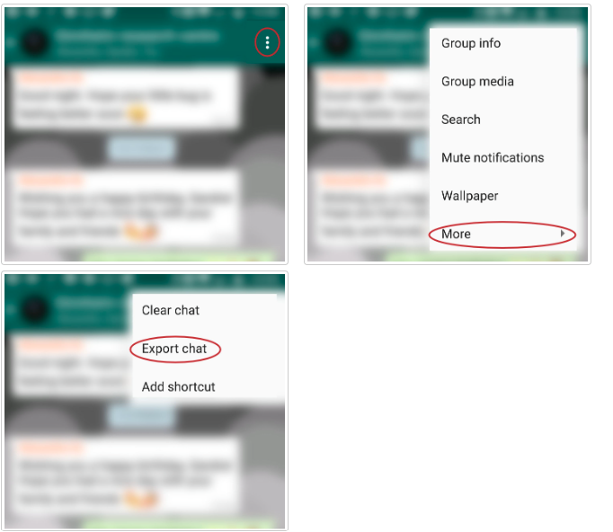
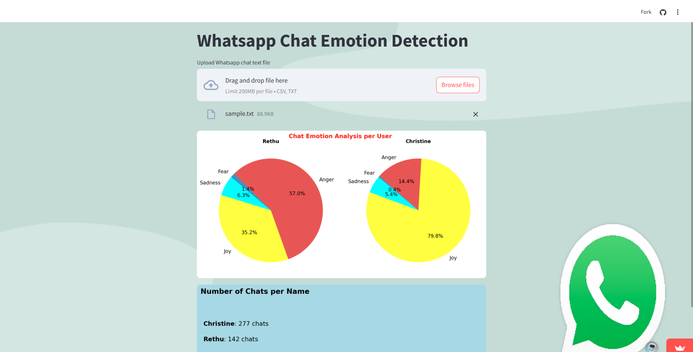

# WhatsApp Chat Emotion Detection

This project detects emotions in WhatsApp chat conversations using an LSTM-based deep learning model trained on a labeled emotion dataset. The solution includes both model development and deployment as a user-friendly Streamlit web app.

The model is trained to classify messages into six emotions: Happy, Sad, Angry, Fear, Love and Surprise

Demo Live Link: https://car-sales-forecasting-4qvmcmb9tdf6pe8kamqtwj.streamlit.app
---

## 1. Emotion Detection Model Pipeline

### 1.1 Data Collection
- Dataset loaded from Hugging Face (`emotion` dataset with 6 emotion labels).

### 1.2 Data Cleaning
- Removal of stopwords using NLTK.
- Lemmatization applied to normalize words.

### 1.3 Tokenization
- Text tokenized and padded using Keras tokenizer.

### 1.4 Embedding
- Pretrained GloVe 100D word embeddings used for vector representation of tokens.

### 1.5 Model Building
- Deep learning model using LSTM and embedding layers.
- Output layer with softmax activation for 6 emotion classes: `joy`, `anger`, `sadness`, `fear`, `love`, `surprise`.

### 1.6 Model Training
- Trained with categorical cross-entropy loss and validation monitoring.
- Model saved for inference.

### 1.7 Evaluation
- Evaluated using Precision, Recall, and F1-score on the validation/test set.

---

## 2. Deployment Pipeline

### 2.1 File Upload & Parsing
- WhatsApp `.txt` chat file is uploaded.
- File is parsed and cleaned into a structured DataFrame format (Name, Chat).

### 2.2 Data Preparation
- Preprocessing applied to convert chat messages to the model's expected input format.

### 2.3 Emotion Prediction
- Preprocessed messages are passed to the trained model.
- Predicted emotion labels are generated.

### 2.4 Visualization
- Pie chart displaying the percentage distribution of predicted emotions.
- plot showing the number of chats per person.

### 2.5 Streamlit Web App
- Fully interactive web app created using Streamlit.
- Hosted app link (example):  
  https://car-sales-forecasting-4qvmcmb9tdf6pe8kamqtwj.streamlit.app

---

## Usage

1. Open the app   
2. Upload your exported Whatsapp chat text file.
3. Explore the type Emotion in the Chat history.

   
